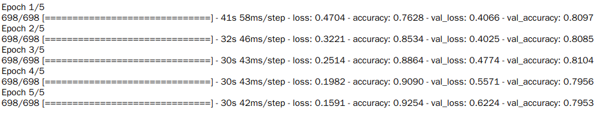
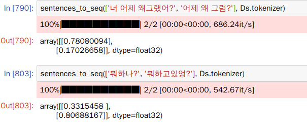

# Toy Projects

> 흥미로운 주제에대한 분석 / 모델링을한 프로젝트들

## Baseball

[결과물(kaggle)](https://www.kaggle.com/park123/baseball-league-match-prediction-by-ml-algorithms)

**개요**

- 2015~2019 KBO(한국프로야구)리그 팀별 승패 및 경기정보 데이터를 바탕으로 2020년 경기들의 결과를 예측
- 각 팀마다 최근 10경기의 경기정보(타율, 출루율, 도루, 득점,승패 등)데이터와 상대팀과의 전적 등을 구해 이를 전력지표로 활용. 두 팀의 전력지표(X)와 경기결과(y)를 모델링에 사용.

**사용모델**

Logistic regression, Decision tree, Random forest, Deep learning

**Data**

**결과**

랜덤포레스트의 depth parameter별 예측 정확도

- 최종적으로 50%를 약간 웃도는 썩 좋지못한 결과를 내었다.
- 변수선택과정에서 승패에 유의미하게 영향을주는 데이터를 사용하지 못했기 때문이라고 생각한다. 야구라는 스포츠가 워낙 변수가 많기때문에 양팀의 최근 출루율, 승률 등 기본적인 데이터도 물론 경기승패에 영향을 미치지만 이 외의 중요한 요소도 많기 때문이다.

## Community_nlp

**개요**

- 카카오톡 메신저를 사용하며 문득 남자와 여자의 말투의 특징이 있음을 파악
- 이런 메신저 데이터는 구할 수 없으므로 남, 여가 많이 이용하는 커뮤니티 사이트를 통해 이러한 특성을 파악
- 에펨코리아(남), 네이트판(여) 사이트에서 각각 2만개 정도의 댓글 데이터 사용

**사용모델/DB**

LSTM, MySQL

**결과**

모델 학습과정에서 val_accuracy는 0.8정도가 나왔으며, test_set에 대해서는 70~75%의 정확도를 보였다(해당 말투가 네이트판인지, 에펨코리아인지를 검증).

실제 남녀 말투가 극명하게 갈리지 않고, 유사한 부분이 많기 때문에 60%정도의 예측률을 기대했는데, 생각보다 잘 나온것 같다. 추후 Bert등의 모델을 이용해 개선시킬예정.

**사용예시**

- 값이 1에 가까울수록 여성 말투에 가깝다.

위의 예시처럼 어느정도 구분을 잘 해줌을 알 수 있다. 시간이 나면 Django로 간단하게 사용자들이 이용할 수 있는 서버를 개발해 배포할 예정.