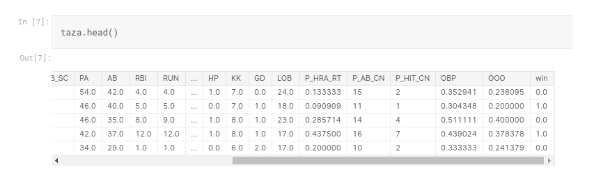
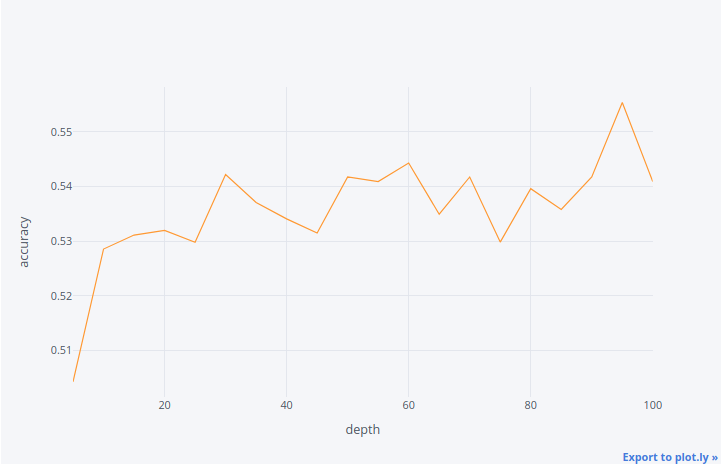

# Toy Projects

> 흥미로운 주제에대한 분석 / 모델링을한 프로젝트들

## Baseball

[결과물(kaggle)](https://www.kaggle.com/park123/baseball-league-match-prediction-by-ml-algorithms)

**개요**

- 2015~2019 KBO(한국프로야구)리그 팀별 승패 및 경기정보 데이터를 바탕으로 2020년 경기들의 결과를 예측
- 각 팀마다 최근 10경기의 경기정보(타율, 출루율, 도루, 득점,승패 등)데이터와 상대팀과의 전적 등을 구해 이를 전력지표로 활용. 두 팀의 전력지표(X)와 경기결과(y)를 모델링에 사용.

**사용모델**

Logistic regression, Decision tree, Random forest, Deep learning

**Data**

**결과**

랜덤포레스트의 depth parameter별 예측 정확도

- 최종적으로 50%를 약간 웃도는 썩 좋지못한 결과를 내었다.
- 변수선택과정에서 승패에 유의미하게 영향을주는 데이터를 사용하지 못했기 때문이라고 생각한다. 야구라는 스포츠가 워낙 변수가 많기때문에 양팀의 최근 출루율, 승률 등 기본적인 데이터도 물론 경기승패에 영향을 미치지만 이 외의 중요한 요소도 많기 때문이다.

